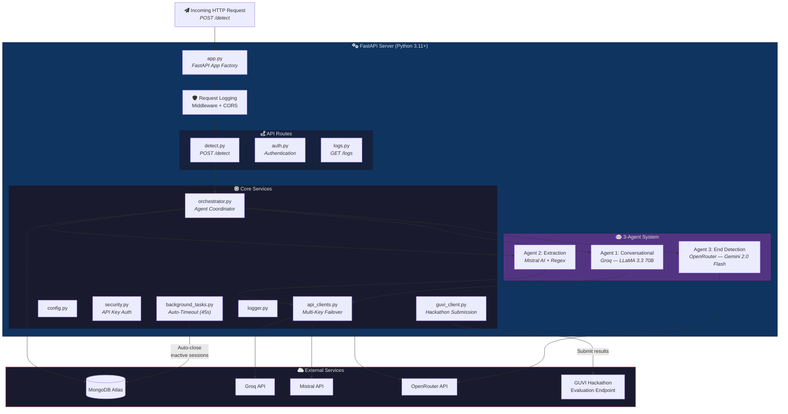
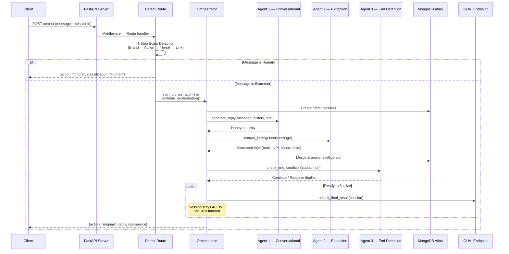
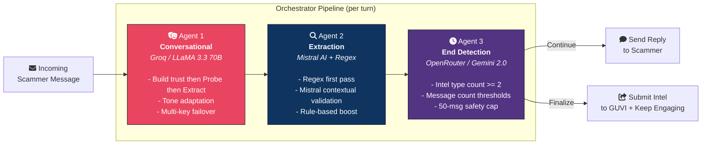

# Dhurvam — Agentic Honey-Pot for Scam Detection & Intelligence Extraction

> An AI-powered honeypot system that detects scam messages, engages scammers in believable conversation, and extracts actionable intelligence — built for the GUVI AI Hackathon.

## Architecture

### System Overview



### Request Flow — Scam Detection & Engagement



### 3-Agent Orchestration Pipeline



## Tech Stack

| Component | Technology |
|-----------|-----------|
| **Backend API** | FastAPI (Python 3.11+) |
| **Agent 1 - Conversational** | Groq API (LLaMA 3.3 70B) with multi-key failover |
| **Agent 2 - Extraction** | Mistral AI + Python Regex (hybrid approach) |
| **Agent 3 - End Detection** | OpenRouter (Gemini 2.0 Flash) |
| **Database** | MongoDB Atlas |
| **Frontend** | Node.js, Express, EJS templates |
| **Deployment** | Docker, Render (backend), Vercel (frontend) |

## 3-Agent System

### Agent 1: Conversational Honeypot
- **Provider**: Groq (LLaMA 3.3 70B Versatile)
- **Purpose**: Acts as a believable victim persona to engage scammers
- **Features**:
  - Dynamic strategy per conversation turn (build trust → probe → extract)
  - Aggressive targeted questioning to extract contact info and payment details
  - Tone adaptation (panic for threats, excitement for offers)
  - Repetition avoidance across turns
  - Multi-key failover for resilience

### Agent 2: Intelligence Extraction
- **Provider**: Mistral AI + Python Regex
- **Purpose**: Extract structured intelligence from scammer messages
- **Extracts**:
  - Bank account numbers (11-18 digit, 16-digit cards)
  - UPI IDs (`user@bank` format)
  - Phone numbers (Indian +91 and 10-digit)
  - Phishing links (HTTP/S, shorteners)
  - Email addresses
  - Suspicious keywords (urgency, threats, prizes)
- **Approach**: Fast regex first pass → Mistral contextual validation → Rule-based boost

### Agent 3: End Detection
- **Provider**: OpenRouter (Google Gemini 2.0 Flash)
- **Purpose**: Decides when sufficient intelligence has been gathered
- **Logic**: Based on intel type count + message count thresholds

## Scam Detection

Uses a **4-step decision framework** (in `detect.py`):
1. **Brand Recognition** — Is message from a known legitimate brand?
2. **Action Analysis** — Is the requested action safe or dangerous?
3. **Threat Analysis** — Is there threatening urgency?
4. **Link Analysis** — Is the URL suspicious?

Classifies messages as **Human** (legitimate) or **Scammer** (engage honeypot).

## API Endpoints

| Method | Endpoint | Description |
|--------|----------|-------------|
| `POST` | `/detect` | Main scam detection & engagement endpoint |
| `POST` | `/api/honeypot/detect` | Authenticated scam detection |
| `GET` | `/api/honeypot/sessions` | List all sessions |
| `GET` | `/api/honeypot/session/{id}/output` | Get session details |
| `POST` | `/api/honeypot/session/{id}/timeout` | End session on timeout |
| `GET` | `/health` | Health check |

## Project Structure

```
Dhurvam/
├── server/                      # FastAPI Backend
│   ├── app/
│   │   ├── agents/
│   │   │   ├── conversational.py  # Agent 1: Honeypot conversation
│   │   │   ├── extraction.py      # Agent 2: Intelligence extraction
│   │   │   └── end_detection.py   # Agent 3: End condition logic
│   │   ├── api/
│   │   │   └── routes/
│   │   │       ├── detect.py      # Main detection route
│   │   │       ├── auth.py        # Authentication
│   │   │       └── logs.py        # Log access
│   │   ├── core/
│   │   │   ├── orchestrator.py    # Coordinates all 3 agents
│   │   │   ├── api_clients.py     # Multi-key API failover manager
│   │   │   ├── guvi_client.py     # GUVI hackathon submission
│   │   │   ├── database.py        # MongoDB connection
│   │   │   ├── config.py          # Environment config
│   │   │   ├── security.py        # API key auth
│   │   │   ├── background_tasks.py # Auto-timeout checker
│   │   │   └── logger.py          # Logging utility
│   │   └── app.py                 # FastAPI app factory
│   ├── main.py                    # Entry point
│   ├── Dockerfile                 # Docker deployment
│   ├── requirements.txt           # Python dependencies
│   └── .env.example               # Environment template
├── web/                           # Node.js Frontend
│   ├── server.js                  # Express server
│   ├── routes/                    # Proxy routes to backend
│   ├── views/                     # EJS templates
│   └── public/                    # Static assets (CSS, JS)
└── README.md
```

## Setup

### Prerequisites
- Python 3.11+
- Node.js 18+
- MongoDB Atlas account
- API keys: Groq, Mistral, OpenRouter

### Backend
```bash
cd server
pip install -r requirements.txt
cp .env.example .env
# Edit .env with your API keys
python main.py
```

### Frontend
```bash
cd web
npm install
cp .env.example .env
# Edit .env with backend URL
node server.js
```

### Docker
```bash
cd server
docker build -t dhurvam-api .
docker run -p 8000:8000 --env-file .env dhurvam-api
```

## Error Handling

- **Multi-key failover**: Each AI provider (Groq, Mistral, OpenRouter) supports multiple API keys with automatic rotation on failure
- **Timeout detection**: Background task checks for 15-second inactivity
- **Graceful degradation**: If all LLM keys fail, minimal fallback responses maintain engagement
- **Request logging**: Full middleware logging for debugging

## License

MIT License
