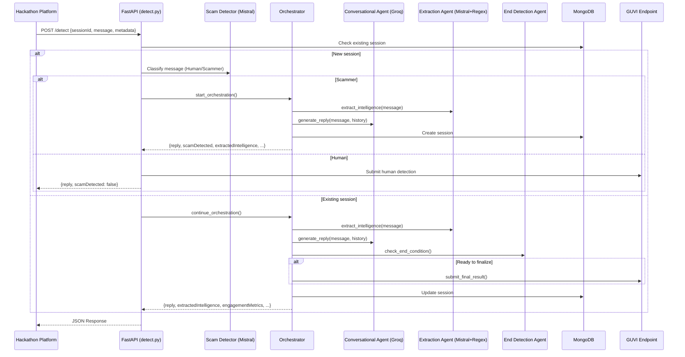

# Dhurvam — System Architecture

## Overview

Dhurvam is an agentic honeypot system that detects scam messages, engages scammers in believable victim-like conversation, and extracts actionable intelligence (phone numbers, bank accounts, UPI IDs, phishing links, emails).

## Request Flow



## 3-Agent Architecture

| Agent | Provider | Purpose | Strategy |
|-------|----------|---------|----------|
| **Conversational** | Groq (LLaMA 3.3 70B) | Generate believable victim replies | Dynamic per-turn strategy: trust-building → probing → extraction |
| **Extraction** | Mistral AI + Python Regex | Extract structured intel from messages | Hybrid: fast regex pass → contextual LLM validation → rule-based boost |
| **End Detection** | OpenRouter (Gemini 2.0) | Decide when to finalize output | Intel-count + message-count thresholds |

## Scam Detection Framework

The 4-step classification in `detect.py`:

1. **Brand Recognition** — Is this from a known brand (SBI, HDFC, Amazon, Airtel)?
2. **Action Analysis** — Is the requested action safe (view offers) or dangerous (share OTP)?
3. **Threat Analysis** — Normal urgency (bill deadline) vs threatening urgency (account blocked)?
4. **Link Analysis** — Official domains vs suspicious shorteners?

## Data Model (MongoDB)

```json
{
  "sessionId": "uuid-v4",
  "status": "active | ended | processing_timeout",
  "createdAt": "datetime",
  "lastActivity": "datetime",
  "metadata": { "channel": "SMS", "language": "English", "locale": "IN" },
  "conversationHistory": [
    { "sender": "scammer|user", "text": "...", "timestamp": "datetime" }
  ],
  "extractedIntelligence": {
    "bankAccounts": [], "upiIds": [], "phoneNumbers": [],
    "phishingLinks": [], "emailAddresses": [], "suspiciousKeywords": []
  },
  "totalMessages": 0,
  "agentNotes": "",
  "scamType": "bank_fraud | upi_fraud | phishing | lottery_scam | ...",
  "confidenceLevel": 0.85,
  "endReason": "intelligence_gathered | timeout | max_messages"
}
```

## API Client Failover

Each LLM provider (Groq, Mistral, OpenRouter) supports **multiple API keys** with automatic rotation:

1. Try current key
2. On failure → rotate to next key
3. Small delay (100ms) between retries
4. All keys exhausted → raise last error

Managed by `GroqClientManager`, `MistralClientManager`, `OpenRouterClientManager` in `api_clients.py`.

## Deployment

- **Backend**: FastAPI on Render (Docker container)
- **Frontend**: Node.js/Express on Vercel
- **Database**: MongoDB Atlas
- **Background**: Auto-timeout task checks for 15s inactivity
